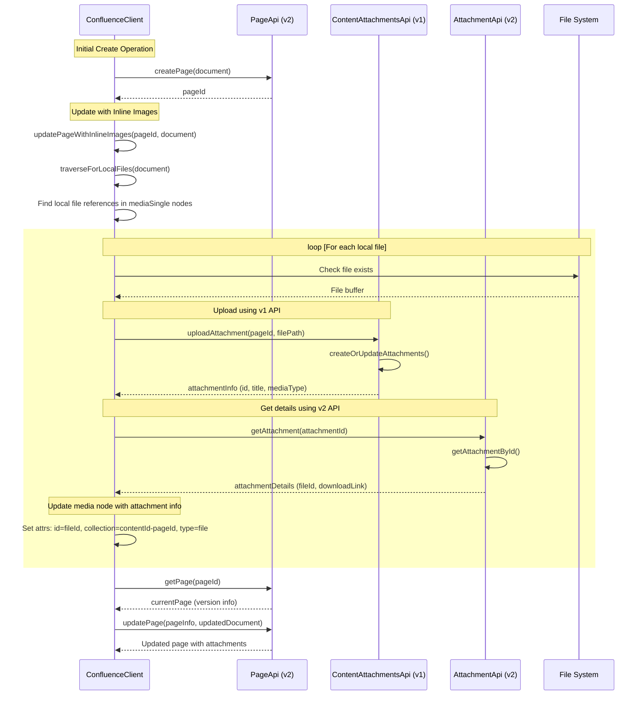

# Markdown to Confluence Sync Action

Sync markdown files to Confluence pages using the Confluence REST API v2/v1.

## Usage

### CLI Usage

```bash
markdown-confluence-sync --title <title> -f <file> -u <user> -t <token> -p <page_id> -d <domain> -s <space_id>
```

### Parameters

- `-f, --file`: Path to the markdown file to sync
- `-u, --user`: Confluence username/email
- `-t, --token`: Confluence API token
- `-p, --page-id`: Parent page ID in Confluence
- `-d, --domain`: Confluence domain (e.g., your-company.atlassian.net)
- `-s, --space-id`: Confluence space ID
- `-l --title`: Page title (inferred from the path otherwise)

### Example

Create a new page, or update an existing page:

```bash
npx @kattebak/markdown-confluence-cli sync -l "Markdown to Confluence" -f README.md -u $CONFLUENCE_USER -t $CONFLUENCE_TOKEN -d $CONFLUENCE_DOMAIN -i $CONFLUENCE_SPACE
```

In this case, @kattebak/markdown-confluence-cli will:

- Create the page if it doesn't exist
- Or find the page by title
- Upload images found in markdown
- Update the page to reference confluence page attachments



### Documentation

This implementation has been completely reverse-engineered, because Atlassian provides no documentation on how to deal with the _adf_ format in the REST api. By uploading pages in _adf_ you get the modern rendering behaviour and editor. If you don't care for any of that, you could simply post HTML with inlined images instead.

- https://github.com/marketplace/actions/markdown-to-confluence-sync
- https://www.npmjs.com/package/@telefonica/markdown-confluence-sync

I learned a lot from studying these implementations as well.

### Development

Test cli in development:

```
tsx src/cli.ts sync -f README.md -u $CONFLUENCE_USER -t $CONFLUENCE_TOKEN -d $CONFLUENCE_DOMAIN -i $CONFLUENCE_SPACE_ID
```
